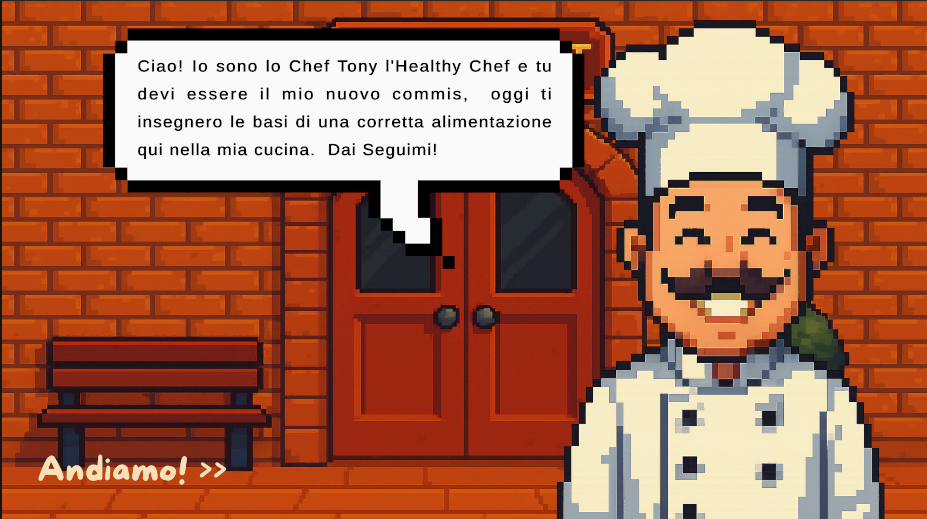

## 🧑‍🍳 **Healthy Chef** 🧑‍🍳

Healthy Chef è un **Serious-Game** inspirato allo stile visual novel con lo scopo di insegnare al giocatore i principi di una'alimentazione sana e bilanciata.

Il gioco vede il giocatore come nuovo commis dello Chef Tony che da diverse nozioni istruttive che poi vanno "provate" tramite diversi semplici minigiochi educativi.

Il nostro progetto è stato interamente realizzato con:

- **.NET 9.0.9**
- **Unity 6000.2.9M**

---

## ⚙️ **Requisiti** ⚙️

Per far funzionare il gioco sul tuo PC avrai bisogno di installare:

- **Unity Editor 6000.2.9M** o versione compatibile
- **.NET SDK 9.0.9**
- (Opzionale) **Visual Studio 2022** o **VS Code** per modificare gli script C#

---

## 🚀 **Avviare il progetto** 🚀

### Unity

1. Aprire **Unity Hub**
2. Aggiungere il progetto all'Hub _(Open => Add project from disk)_
3. Selezionare la cartella principale del progetto
4. Avviare la scena principale _(Title Scene)_

### Build

1. Nello Unity Hub selezionare le Build Settings _(Open => Add project from disk)_
2. Selezionare la Piattaforma / Sistema Operativo desiderato
3. Cliccare su **Build and Run**

---

## 📁 **Struttura del progetto** 📁
```text
Healthy-Chef/
├─ .gitignore
├─ REDME.md
├─ bin/                         # Output compilazioni .NET
├─ obj/                         # File temporanei di compilazione
|
├─ Project/
│ ├─ Assets/                    # _Risorse di gioco principali_
| | |
│ │ ├─ Animations/              # _Controller e clip per animazioni (es. Chef Tony, DialogPanel)_
│ │ ├─ Audio/                   # _Colonne sonore e musiche ambientali_
│ │ ├─ Materials/               # _Materiali utilizzati nei prefab e scene_
│ │ ├─ Prefab/                  # _Oggetti prefab (cibo, UI, manager, ecc.)_
| | |
│ │ ├─ Resources/
│ │ │ └─ Dialogues/             # _Testi e script narrativi delle varie sezioni_
| | |
│ │ ├─ Scenes/                  # _Scene principali (Menu, Quiz, Piramide, Minigame, ecc.)_
│ │ ├─ Script/                  # _Script C# (GameManager, DialogManager, MusicPlayer, ecc.)_
│ │ ├─ Sprite/                  # _Grafica (Tony, cibi, UI, sfondi)_
│ │ ├─ TextMesh Pro/            # _Font, materiali e risorse per UI testuale_
│ │ ├─ Settings/                # _Configurazioni URP e template di scena_
│ │ └─ ToRemove/                # _Script o file in disuso_
│ │
│ ├─ Library/                   # _Cache e database Unity (generati automaticamente)_
│ ├─ Packages/                  # _Dipendenze del progetto Unity_
│ ├─ ProjectSettings/           # _Impostazioni di progetto Unity_
│ └─ .vscode/                   # _Configurazione editor VS Code_
│
└─ repo-tree.txt                # _Mappa generata della repo_
```

---

## 👥 **Autori** 👥

- **Marcello Miranda** - *https://github.com/MarcyMiranda2004*
- **Alessandro Imbriani** - *https://github.com/Rela45*
- **Gabriele Frangiosa** - *https://github.com/DemonBloodstorm*

---

## 📸 **Immagini**





